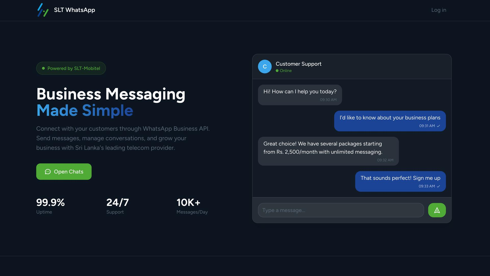
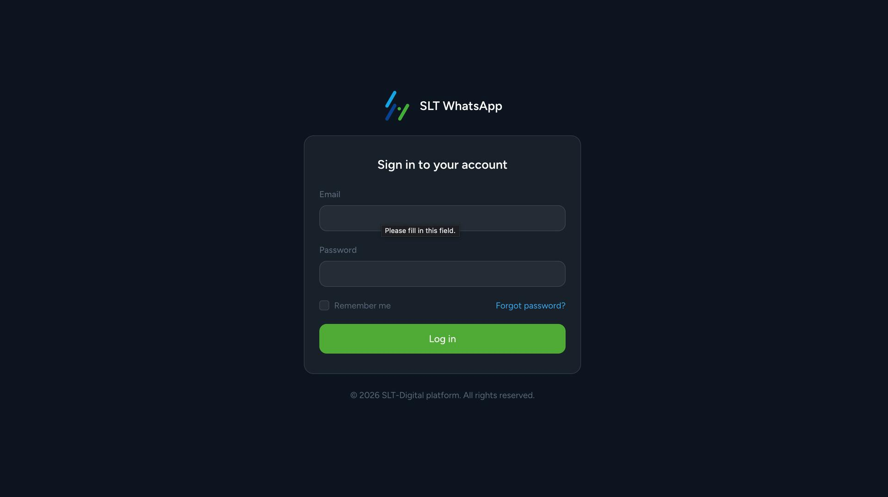
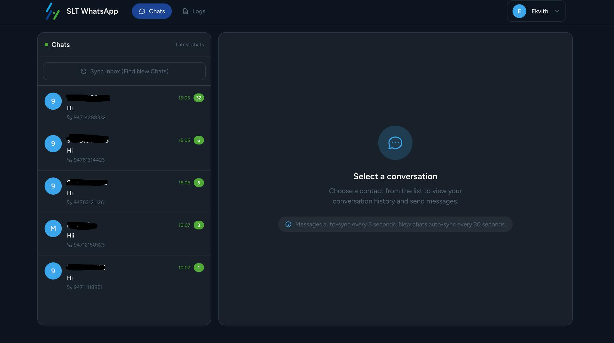

# SLT WhatsApp Demo

<p align="center">
  
</p>

<p align="center">
  A Laravel-based internal WhatsApp support dashboard for SLT teams.
  <br>
  View recent chats, lock conversations, reply from the web UI, and monitor API activity in one place.
</p>

## Overview

This project is a web dashboard for handling WhatsApp conversations through the SLT WhatsApp API.

It is designed for support or operations teams who need a simple workflow:

1. Sign in as an internal user.
2. Pull recent active mobile numbers into the chat list.
3. Open a conversation.
4. Take the chat lock so only one admin replies.
5. Send replies from the dashboard.
6. Review API and application logs when needed.

## Main Screens

The UI shown in the current design has 3 main screens:

### 1. Landing Page

The landing page introduces the product as a business messaging tool powered by SLT-Mobitel.

It highlights:

- the WhatsApp-based customer communication use case
- a direct `Open Chats` call to action
- a preview chat panel
- key stats such as uptime, support availability, and message volume

<p align="center">
  
</p>

### 2. Login Page

The login page is a simple internal sign-in screen for team members.

It includes:

- email and password login
- remember-me support
- forgot-password link
- secure access before entering the chat workspace

<p align="center">
  
</p>

### 3. Chat Dashboard

The dashboard is the main working screen for agents and admins.

It includes:

- a chat list on the left
- a `Sync Inbox (Find New Chats)` button
- a conversation panel on the right
- auto-refreshing messages
- contact save/edit support
- chat locking to prevent two admins replying at the same time
- connection and activity status indicators

<p align="center">
  
</p>

## What This App Does

- Fetches recent active mobile numbers from the SLT endpoint:
  `GET https://dpdlab2.slt.lk/getRecentActiveMobiles.php`
- Shows chats per contact inside a web interface
- Loads message history directly from the SLT API
- Sends replies through the SLT reply endpoint
- Stores outgoing replies locally for UI continuity
- Keeps a local contact list in MySQL
- Provides API logs and Laravel error logs
- Restricts the logs page to admin users

## How It Works

### Chat Flow

1. The user signs in.
2. The dashboard loads recent contacts.
3. The user selects a contact to open the conversation.
4. The app fetches messages live from the SLT API.
5. Before replying, the user can click `Take Chat` to lock the conversation.
6. The reply is sent using the latest inbound message UUID.
7. The sent reply is saved locally and shown in the chat thread.

### Contact Sync Flow

1. The app calls the recent-active-mobiles API.
2. Mobile numbers are normalized to `94xxxxxxxxx` format.
3. Contacts are inserted or updated in the `contacts` table.
4. The refreshed contacts appear in the sidebar chat list.

## Features

- Auth-protected chat workspace
- Clean landing page and login experience
- Recent contact sync from SLT API
- Live message polling in the chat UI
- Manual chat sync button
- Multi-admin chat lock with expiry
- Contact rename/save modal
- API request logging
- Laravel error log viewer
- Admin-only logs page

## Tech Stack

- Laravel 12
- PHP 8.2+
- MySQL
- Blade templates
- Alpine.js
- Tailwind CSS
- Vite

## Requirements

Before running the project, make sure you have:

- PHP 8.2 or newer
- Composer
- Node.js and npm
- MySQL

## Quick Start

### 1. Install dependencies

```bash
composer install
npm install
```

### 2. Create your environment file

```bash
cp .env.example .env
```

### 3. Generate the app key

```bash
php artisan key:generate
```

### 4. Configure the database

Update `.env` with your MySQL credentials, then run:

```bash
php artisan migrate
php artisan db:seed
```

The seed step creates default admin users for login.

### 5. Build frontend assets

```bash
npm run build
```

### 6. Start the application

```bash
php artisan serve
```

For the background scheduler:

```bash
php artisan schedule:work
```

## Local Development

If you want the full local dev stack in one command, use:

```bash
composer run dev
```

This starts:

- the Laravel server
- the queue listener
- the Laravel log viewer process
- the Vite dev server

## Default Admin Users

The database seeder creates these admin accounts:

| Name | Email |
| --- | --- |
| Kosala | `kosala@slt.lk` |
| Charith | `charith@slt.lk` |
| Menusha | `menusha@slt.lk` |
| Ekvith | `ekvith@slt.lk` |

Default password for all seeded accounts:

```text
Admin@123
```

Change the password after first login.

## Important Notes About Access

- Public registration is not enabled in routes.
- Use the seeded admin accounts, or create users manually.
- The chat area requires authenticated users.
- Seeded admin users are already marked as verified in the database.
- The logs page requires `is_admin = 1`.

## Environment Variables

These are the main values you should review in `.env`:

| Variable | Purpose |
| --- | --- |
| `APP_NAME` | Application name shown in the UI |
| `APP_URL` | Base URL for local or deployed access |
| `DB_CONNECTION`, `DB_HOST`, `DB_PORT`, `DB_DATABASE`, `DB_USERNAME`, `DB_PASSWORD` | MySQL connection |
| `SLT_API_BASE` | Base URL for the SLT WhatsApp API |
| `SLT_API_USERNAME` | API username used for `login.php` |
| `SLT_API_PASSWORD` | API password used for `login.php` |
| `SLT_PHONE_NUMBER_ID` | Required when sending replies |
| `SLT_API_BEARER_TOKEN` | Optional fixed token if you want to skip `login.php` |
| `CHAT_LOCK_TTL_SECONDS` | How long a chat lock stays valid |
| `CHAT_LIST_LIMIT` | Number of contacts shown in the sidebar |
| `CHAT_SYNC_RECENT_LIMIT` | How many recent mobiles to sync at a time |
| `CHAT_SYNC_RECENT_MAX_LIMIT` | Upper limit for contact sync size |
| `CHAT_ERROR_ACTIVE_WINDOW_MINUTES` | Active/fixed window for error status in logs |

## API Endpoints Used

The app currently integrates with these SLT API routes:

- `POST /login.php`
- `POST /getMessages.php`
- `GET /getRecentActiveMobiles.php`
- `POST /reply.php`

## Scheduler Behavior

Running `php artisan schedule:work` keeps recent contacts updated in the background.

Current scheduled task:

- `whatsapp:sync-contacts --limit=<configured limit>` every minute

Important:

- message history is loaded live from the SLT API in the UI
- the message sync scheduler is currently disabled

## Useful Commands

```bash
php artisan migrate
php artisan db:seed
php artisan serve
php artisan schedule:work
php artisan whatsapp:sync-contacts --limit=40
php artisan whatsapp:sync --limit=20
```

## Logs

The logs page has two tabs:

- `API Logs`: request history, status codes, and response time
- `Error Logs`: Laravel application errors grouped as active or fixed

This is useful when:

- the SLT API returns failures
- a token expires
- replies fail
- you need to inspect request payloads or response timing

## Project Structure

| Path | Purpose |
| --- | --- |
| `app/Services/SltWhatsappClient.php` | Handles SLT API login, fetch, and reply calls |
| `app/Http/Controllers/ChatController.php` | Chat pages and chat list rendering |
| `app/Http/Controllers/ChatApiController.php` | Message fetch, send, read, and sync endpoints |
| `app/Http/Controllers/ContactController.php` | Contact create, update, and recent sync |
| `app/Http/Controllers/LogController.php` | API logs and Laravel error logs |
| `app/Console/Commands/WhatsappSyncContacts.php` | Syncs recent active mobiles into contacts |
| `app/Console/Commands/WhatsappSync.php` | Optional message sync command |
| `resources/views/welcome.blade.php` | Landing page |
| `resources/views/auth/login.blade.php` | Login page |
| `resources/views/chats/` | Chat dashboard UI |
| `resources/views/logs/` | Logs UI |

## Plain-English Summary

If someone new joins the project, this is the easiest way to understand it:

- This is not just a Laravel starter app.
- It is an SLT WhatsApp support dashboard.
- Users log in, open chats, and reply to customers from the browser.
- Contacts can be discovered automatically from the recent-active-mobiles API.
- Messages are mainly read live from the SLT API, not fully mirrored by a background sync job.
- Admins can inspect logs and manage chat ownership safely with locks.

## License

This project is open-sourced under the [MIT license](https://opensource.org/licenses/MIT).
